<!-- HEADER -->
<head>
	<!-- Title -->
	<h1 align = center style = "border-bottom:0; padding: 0">
		FnPiPER
	</h1>
	<!--  -->
	<!-- Subtitle -->
	<h2 align = center style = "border-bottom:0; margin-top: 0">
		<ins>F</ins>ST a<ins>n</ins>d <ins>Pi</ins> <ins>P</ins>opulation <ins>E</ins>stimation <ins>R</ins>esource
	</h2>
</head>


<br>

<!-- Shields -->
<div align="center">

  
  
  
</div>

<!-- TABLE OF CONTENTS -->
<details>
  <summary>Table of Contents</summary>
  <ol>
    <li><a href="#description">Description</a></li>
    <li><a href="#installation">Installation</a></li>
    <li>
		<a href="#usage">Usage</a>
		<ul>
			<li><a href="#setup-conda-environments">Setup Conda Environments</a></li>
			<li><a href="#required-files">Required Files</a></li>
			<li><a href="#general">General</a></li>
			<li><a href="#file-naming">File Naming</a></li>
			<li><a href="#config-file">Config File</a></li>
		</ul>
	</li>
    <li><a href="#workflow">Workflow</a></li>
	<li><a href="#final-file-structure">Final Structure</a></li>
    <li><a href="#known-issues">Known Issues</a></li>
	<li>
		<a href="#contribute">Contribute</a>
		<ul>
			<li><a href="#report-a-bug">Report a Bug :bug:</a></li>
			<li><a href="#request-a-feature">Request a Feature :sparkles:</a></li>
		</ul>
	</li>
    <li><a href="#license">License</a></li>
    <li><a href="#contact">Contact</a></li>
    <li><a href="#acknowledgments">Acknowledgments</a></li>
  </ol>
</details>

---

<!-- BODY -->
## Description
Pipeline for cleaning Illumina reads, mapping to a reference genome, calling variants, and estimating male/female pi and FST.

## Installation
Download `FnPiPER-main.zip`. Move this file to your directory and unzip it. If you'd like to rename the folder, do so before proceeding.

Or clone from GitHub via command line (but you'll need to provide an SSH key for this option):

```bash
git clone git@github.com:ryanacook2/FnPiPER.git
```

If you're running the pipeline, remove the `.git/`, `.github/`, and `.vscode/` directories if they are present - these aren't needed to run the pipeline and we don't want reads/genomes/etc. version controlled.

```bash
rm -rf .git/ .github/ .vscode/
```

## Usage
### Setup Conda environments
To use FnPiPER, you need to setup the appropriate conda environments. Ideally, this is setup in the script, but that doesn't seem to be working perfectly, so for now, it must be done manually. Three conda environments should be created: 
#### 1. PopStats

**Requires Packages**
- python (Version 3.8.18)
- pixy
- htslib

##### Code
```bash
# Create conda environment PopStats
conda create PopStats

# Activate the environment
conda activate PopStats

# Install required packages
conda install python=3.8.18 pixy htslib

# Deactivate environment
conda deactivate
```


#### 2. Snps
**Required Packages**
- bwa-mem2
- multiqc
- bedtools
- samtools
- vcflib
- bamtools
- bcftools
- freebayes (Version 1.3.6)
- bamaddrg
- sambamba
- trim-galore
- mosdepth

##### Code
```bash
# Create conda environment Snps
conda create Snps

# Activate the environment
conda activate Snps

# Install required packages
conda install bwa-mem2 multiqc bedtools samtools vcflib bamtools bcftools freebayes=1.3.6 bamaddrg sambamba trim-galore mosdepth

# Deactivate environment
conda deactivate
```

#### 3. FnPiPER-R
**Required Packages**
- r-base
- r-essentials (this will take a while to install)

##### Code
```bash
# Create conda environment FnPiPER-R
conda create FnPiPER-R

# Activate the environment
conda activate FnPiPER-R

# Install required packages
conda install r-base r-essentials

# Deactivate environment
conda deactivate
```

### Required Files
- Paired reads ( `.fastq.gz` )
- Reference genome ( `.fasta` )

### General
Copy your reads and reference genome to the directory `FnPiPER-main/` and ensure that they are appropriately named (see "File Naming" below). Then execute the script `FnPiPER.sh` with the command `./FnPiPER.sh` to setup your config file. Once that is generated, check to make sure it's correct, and if it is, execute `FnPiPER.sh` again to start the job.

### File Naming
<!-- Reads -->
#### Reads
The reads should be named in the format `Genus_species_ID_Sex_Read#.fastq.gz`, where "Sex" is either "M" (male) or "F" (female) and "Read#" is either "1" (forward) or "2" (reverse). The reads should be gzipped fastq files.\
For example:
- `Gekko_gecko_TG1234_M_1.fastq.gz`
- `Gekko_gecko_TG1234_M_2.fastq.gz`
- `H_turcicus_MVZ0001_F_1.fastq.gz`
- `H_turcicus_MVZ0001_F_2.fastq.gz`

If the "ID" (or any other field) has any underscores, remove them, as these are used as separators in the code.

<!-- Reference genome -->
#### Reference Genome
The reference genome should be named in the format `genome_SOMETEXT.fasta`. It doesn't matter what "SOMETEXT" is, but the filename must start with `genome_` and end with `.fasta`.\
For example:
- `genome_kuhli.fasta`

><strong>NOTE</strong><br>
>If the reference genome FASTA headers have semicolons, they may need to be renamed.

<br>

### Config File

The config file tells the script what to do. There should be no spaces between the variable name its value (e.g. `total_hours:100`). Only the text in the code block is present in the config file. It defines the following:
- `email:`
	- User email for email notifications
- `pd:/path/to/project/directory/FnPiPER`
	- Path to project directory
- `freebayes_hours:72`
	- Hours for the variant calling job (default 72)
- `total_hours:100`
	- Hours for total hours allowed for FnPiPER (default 100)
- `genus:`
	- Genus for the species your studying (extracted from read filenames)
- `species:`
	- Species for the species your studying (extracted from read filenames)
- `genome:${pd}/working/genome_whatever.fasta`
	- Path to reference genome
- `read_format:Genus_species_ID_Sex_Read.fastq.gz`
	- Naming format for reads (default shown)
- `window_size:`
	- Window sizes for pixy and mosdepth. User-specified number of windows and their sizes.
- `doCheckCondaEnvs:true`
	- Whether or not to check conda environments (true/false)
- `doSubmit:true`
	- Whether or not to submit the job to Raj (true/false)
- `doCleanReads:true`
	- Whether or not to clean the reads (true/false)
- `doIndexReferenceGenome:true`
	- Whether or not to index the reference genome (true/false)
- `doMapReads:true`
	- Whether or not to map the reads (true/false)
- `doCallVariants:true`
	- Whether or not to call variants (true/false)
- `doPixy:true`
	- Whether or not to run pixy for Pi and FST (true/false)
- `doMosdepth:true`
	- Whether or not to run mosdepth for read depth (true/false)
- `doPlotting:true`
	- Whether or not to generate plots - uses R (true/false)
- `plot_type:all`
	- Which plots to generate (unused right now, leave as "all")
- `pixy_stats:both`
	- Which stats (Pi or FST) to get from pixy (unused right now, leave as "both")

<br>

## Workflow

```mermaid
flowchart TD
  subgraph identifier[" "]
    %% PROCESSES
    Setup{Setup}
    Clean{Clean<br>Reads}
    Index{Index Ref<br>Genome}
    Map{Map<br>Reads}
    Variants{Call<br>Variants}
    Pixy{Pixy}
    Mosdepth{Mosdepth}
    Plot{Plotting}

    %% FILES
    R1([Raw Forward Read])
    R2([Raw Reverse Read])
    C1([Clean Forward Read])
    C2([Clean Reverse Read])
    G([Reference Genome])
    GI([Indexed Genome])
    BAM([BAM])
    VCF([VCF])
    Names([names.txt])
    Bamlist([bamlist.txt])
    List([list.txt])
    Windows([windowSizes.txt])
    Fst([pixy_fst.txt])
    Pi([pixy_pi.txt])
    Depth([mosdepth files])
    Temp([Script Templates])
    Slurm([Slurm Scripts])
    PDF([PDFs])

    %% DIAGRAM
    Setup ==o R1 & R2 & G
    Setup -.-> Names & Bamlist & Windows & List & Slurm
    Setup ~~~ Temp
    List & Temp --> Slurm
    R1 & R2 --> Clean -.-> C1 & C2
    G --> Index -.-> GI
    C1 & C2 & GI --> Map
    Map -.-> BAM
    Bamlist & Names & GI --> Variants
    Variants -.-> VCF
    BAM & Windows --> Mosdepth
    Mosdepth -.-> Depth
    VCF & Names & Windows --> Pixy
    Pixy -.-> Fst & Pi
    BAM --> Variants
    Fst & Pi & Depth --> Plot
    Plot -.-> PDF

    %% STYLING

    %% Checking
    %% linkStyle 0,1,2 stroke:red

    %% File Output
    %% linkStyle 3,4,5,6,7,8,9,12,13,15,19,24,28,29,32,36 stroke:green
    
    %% File Input
    %% linkStyle 10,11,14,16,17,18,20,21,22,23,25,26,27,30,31,33,34,35 stroke:blue

    %% User-Supplied File
    classDef userFile stroke:orange
    class R1,R2,G userFile

    %% Base File
    classDef baseFile stroke:yellow
    class Temp baseFile

    %% Intermediate File
    classDef intFile stroke:green
    class List,Slurm,Names,Bamlist,Windows intFile

    %% Output File
    classDef outFile stroke:red
    class C1,C2,GI,BAM,VCF,Fst,Pi,Depth,PDF outFile

    %% Process
    classDef process stroke:purple
    class Setup,Clean,Index,Map,Variants,Pixy,Mosdepth,Plot process

  end

  subgraph Legend
      direction LR

      %% Check File
      a1[ ] ==o|Check File| b1[ ] ~~~ Base([Base File]):::baseFile ~~~ User([User Supplied]):::userFile
      style a1 height:0px;
      style b1 height:0px;

      %% Input File
      a2[ ] -->|Input| b2[ ] ~~~ Int([Intermediate File]):::intFile ~~~ Out([Output File]):::outFile
      style a2 height:0px;
      style b2 height:0px;

      %% Output File
      a3[ ] -.->|Output| b3[ ] ~~~ Process{Process}:::process ~~~ c3[ ]
      style a3 height:0px;
      style b3 height:0px;
      style c3 height:0px;
  end
```



1. Setup
2. Clean Reads
3. Index Reference Genome
4. Map Reads
5. Call variants
6. Get FST and Pi with pixy
7. Get Read Depth with mosdepth
8. Plot with R

## Final File Structure
Upon execution of `FnPiPER.sh`, files are moved into appropriate directories. The directory structure will be as follows (excluding `.build/`):

- <details open>
  <summary>FnPiPER</summary>

  - <summary>FnPiPER.sh</summary>
  
  - <summary>FnPiPER.slurm</summary>

  - <summary>README.md</summary>

  - <summary>config.txt</summary>
	<!-- Files -->
  - <details>
    <summary>files</summary>

    - bamlist.txt
    - list.txt
	- names.txt
    - windowSizes.txt

    </details>

  - <summary>log-[datetime-uid].txt</summary>
	<!-- Scripts -->
  - <details>
    <summary>scripts</summary>

	  - <details>
		<summary>checkCondaEnvs</summary>
		
		- slurm scripts
		- log files
		</details>

	  - <details>
		<summary>cleanReads</summary>
		
		- slurm scripts
		- log files
		</details>

	  - <details>
		<summary>freebayes</summary>
		
		- slurm scripts
		- log files
		</details>

	  - <summary>functions.sh</summary>

	  - <details>
		<summary>indexReferenceGenome</summary>
		
		- slurm scripts
		- log files
		</details>

	  - <details>
		<summary>mapReads</summary>
		
		- slurm scripts
		- log files
		</details>

	  - <details>
		<summary>mosdepth</summary>
		
		- slurm scripts
		- log files
		</details>

	  - <details>
		<summary>pixyStats</summary>
		
		- slurm scripts
		- log files
		</details>

	  - <details>
		<summary>plot_with_R</summary>
		
		- slurm scripts
		- log files
		</details>
	
	  - <details>
		<summary>setup</summary>
		
		- setup scripts
		</details>

	  - <details>
		<summary>templates</summary>
		
		- slurm script templates
		</details>
	</details>

  - <details>
	<summary>working</summary>

	- <summary>*.rg.bam</summary>
	- <summary>*.rg.bam.bai</summary>
	- <summary>*.sam</summary>
	- <summary>*.genome.fasta</summary>
	- <summary>*.genome.fasta.[index files]</summary>
	  <!-- Output -->
	- <details>
	  <summary>output</summary>

	  - <summary>*all_fst.pdf</summary>
	  - <summary>*all_plots.pdf</summary>
	  - <details>
		<summary>mosdepth</summary>

		  - Mosdepth output files
	    </details>
	  - <details>
		<summary>pixy</summary>

		  - pixy_[windowSize]_fst.txt
		  - pixy_[windowSize]_pi.txt
	    </details>
	  </details>
	- <details>
	  <summary>reads</summary>

	  - <details>
	    <summary>clean</summary>

		- <summary>*.fastq.gz_trimming_report.txt</summary>
		- <summary>*_val_*.fq.gz</summary>
		- <details>
		  <summary>fastqc</summary>

		  - <summary>*fastqc.html</summary>
		  - <summary>*fastqc.zip</summary>
		  </details>

		</details>

	  - <details>
	    <summary>raw</summary>

		- *.fastq.gz
		</details>
	  </details>
	- <summary>variants.vcf.gz</summary>
	- <summary>variants.vcf.gz.tbi</summary>
	</details>

</details>

<br>

```
├── FnPiPER/
│   ├── FnPiPER.sh
│   ├── FnPiPER.slurm
│   ├── README.md
│   ├── config.txt
│   ├── files/
│   │   ├── bamlist.txt
│   │   ├── list.txt
│   │   ├── names.txt
│   │   ├── windowSizes.txt
│   ├── log-[datetime-uid].txt
│   ├── scripts/
│   │   ├── chechCondaEnvs/
│   │   ├── cleanReads/
│   │   ├── freebayes/
│   │   ├── functions.sh
│   │   ├── indexReferenceGenome/
│   │   ├── mapReads/
│   │   ├── mosdepth/
│   │   ├── pixyStats/
│   │   ├── plot_with_R/
│   │   ├── setup/
│   │   ├── templates/
│   ├── working/
│   │   ├── *.rg.bam
│   │   ├── *.rg.bam.bai
│   │   ├── *.sam
│   │   ├── genome_*.fasta
│   │   ├── genome_*.fasta.[index_files]
│   │   ├── output/
│   │   │   ├── *_all_fst.pdf
│   │   │   ├── *_all_plots.pdf
│   │   │   ├── mosdepth/
│   │   │   │   ├── [read depth files]
│   │   │   ├── pixy/
│   │   │   │   ├── pixy_[windowSize]_fst.txt
│   │   │   │   ├── pixy_[windowSize]_pi.txt
│   │   ├── reads/
│   │   │   ├── clean/
│   │   │   │   ├── *.fastq.gz_trimming_report.txt
│   │   │   │   ├── *_val_*.fq.gz
│   │   │   │   ├── fastqc/
│   │   │   │   │   ├── *fastqc.html
│   │   │   │   │   ├── *fastqc.zip
│   │   │   ├── raw/
│   │   │   │   ├── *.fastq.gz
│   │   ├── variants.vcf.gz
│   │   ├── variants.vcf.gz.tbi
```

<!-- Known Issues -->
## Known Issues
- [*Bugs 0001-0003, 0005*] <br> Unable to automatically detecting & building conda environments<br><br>
- [*Bug 0004*] <br> If you don't clean the reads, input reads do not get moved and renamed to the `working/reads/clean/` directory, which is where the read mapping looks for reads.
  - Looks like Sarah's didn't put Genus/species name on R plot titles, could be leftover weirdness from [*Bug 0004*]


## Contribute
<!-- Report a Bug -->
### [Report a Bug :bug:](https://github.com//Zuleihatidris/FnPiPER/issues/new?template=bug_report.md)

<!-- Request a Feature -->
### [Request a Feature :sparkles:](https://github.com/Zuleihatidris/FnPiPER/issues/new?template=feature_request.md)
